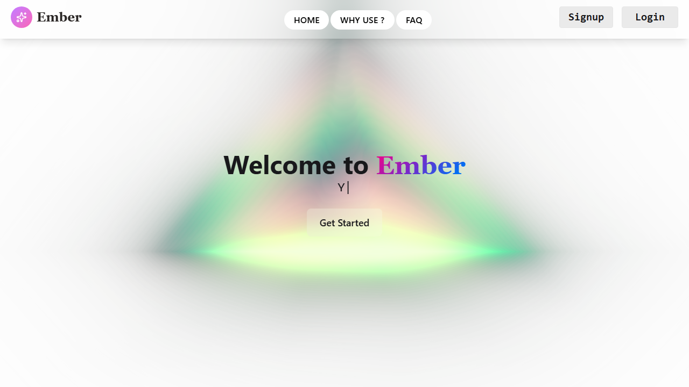
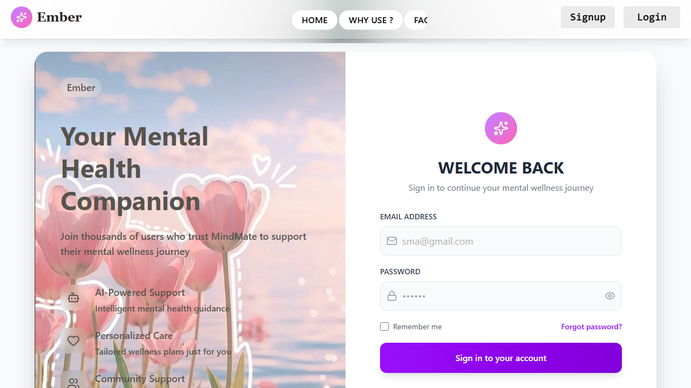
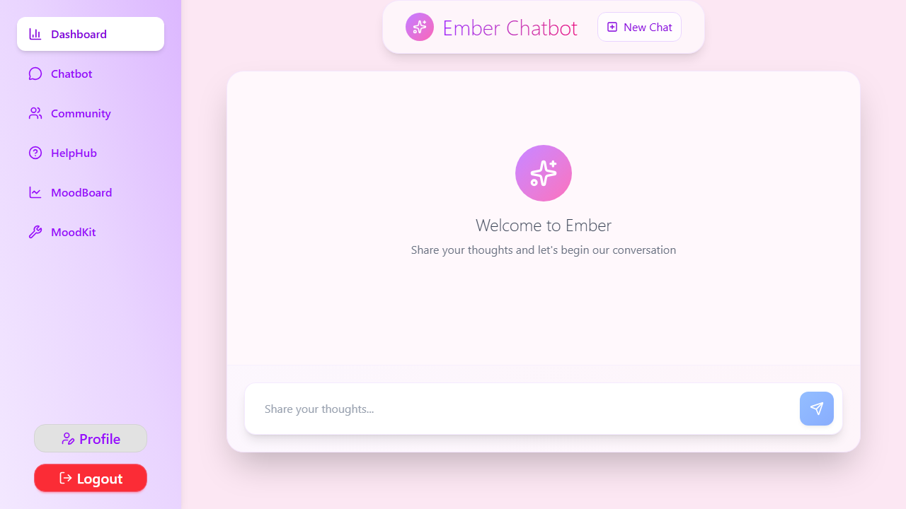
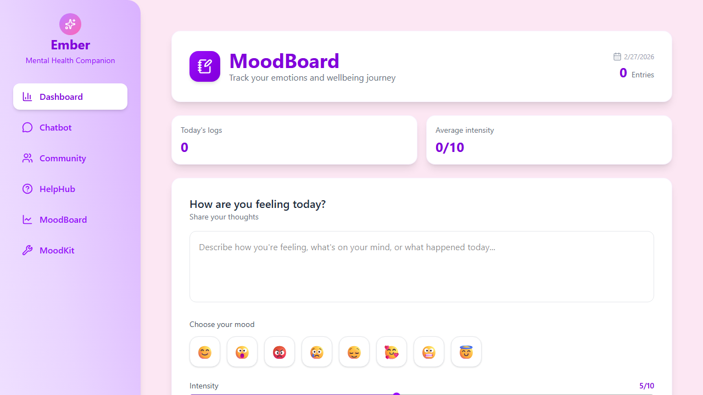
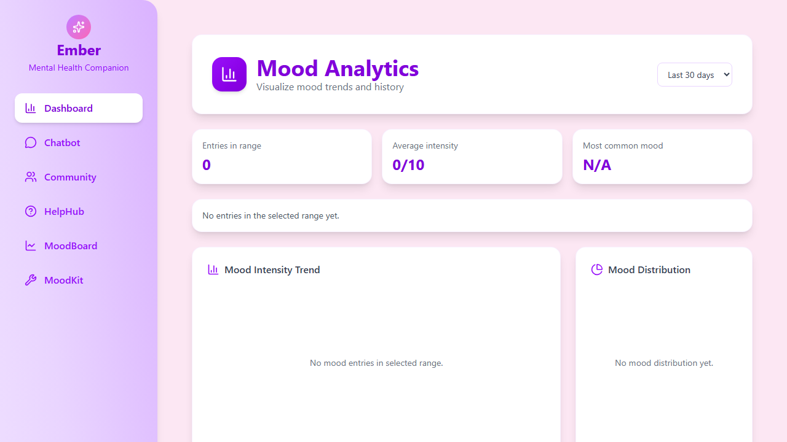

# Ember


Ember is a mental wellness web app that combines mood tracking, journaling, guided self-help tools, a supportive community feed, and an AI chat companion.

## Table of Contents

- [What this project does](#what-this-project-does)
- [Why this project is useful](#why-this-project-is-useful)
- [Features](#features)
- [Tech stack](#tech-stack)
- [Project structure](#project-structure)
- [Getting started](#getting-started)
- [Usage examples](#usage-examples)
- [Screenshots](#screenshots)
- [Support](#support)
- [Maintainers and contributing](#maintainers-and-contributing)

## What this project does

Ember provides a full-stack mental health support experience:

- **AI chat assistant** with conversation history and checklist generation.
- **Mood tracking** with analytics and heatmap visualization.
- **Journaling** with create, edit, delete, and history.
- **Community support forum** with posts, comments, and likes.
- **Wellness checklist** integrated with chatbot-generated routines.

Core frontend routes are defined in [frontend/src/Routes/Routes.jsx](frontend/src/Routes/Routes.jsx).

## Why this project is useful

- Gives users a **single place** for reflection (journal), tracking (mood), and action (checklists).
- Uses **persistent Supabase-backed data**, so user progress is not tied to one browser session.
- Includes both **self-guided tools** (breathing, meditation, journaling) and **community interaction**.
- Supports practical development workflows with clearly separated frontend and backend modules.

## Features

### Authentication and profile

- Email/password sign-up and login via Supabase auth.
- Profile-backed user identity for personalized content.

### AI chat and wellness guidance

- Conversational mental-health assistant powered by Gemini.
- Role-aware responses (assessment, action plan, follow-up style).
- Persistent chat history with **New Chat** reset support.
- Checklist generation and daily checklist updates.

### Mood tracking and analytics

- Mood entry logging (label, emoji, intensity, note).
- Time-range analytics (7/30/90 days).
- Intensity trend chart and mood distribution chart.
- Heatmap view for consistency/completion insights.

### Journaling

- Create, read, update, and delete journal entries.
- Chronological journal history with full-entry view/edit.

### Community support forum

- Create and browse community posts.
- Like/unlike post interactions.
- Toxicity-filtered comments with pagination.

### Wellness toolkit

- Breathing exercises.
- Meditation and soothing media modules.
- Daily checklist tracking.

## Tech stack

### Frontend

- React + Vite
- React Router
- Tailwind CSS
- Zustand
- Axios
- Recharts
- Supabase JS client

### Backend

- FastAPI
- Supabase Python client
- Google Gemini (`google-genai`)
- Pydantic

## Project structure

```text
.
├── backend/
│   ├── api/         # FastAPI route handlers
│   ├── services/    # Business logic and external integrations
│   ├── schemas/     # Pydantic request/response models
│   ├── main.py      # FastAPI app entrypoint
│   └── requirements.txt
├── frontend/
│   ├── src/
│   │   ├── Pages/       # Page-level UI (MoodBoard, MoodDashboard, etc.)
│   │   ├── components/  # Reusable components and features
│   │   ├── Routes/      # App routes
│   │   └── store/       # Zustand store
│   └── package.json
└── README.md
```

## Getting started

### Prerequisites

- Node.js 18+
- Python 3.10+
- Supabase project (URL + keys)
- Gemini API key

### 1) Clone and install

```bash
git clone https://github.com/smabdullah2002/Ember.git
cd Ember
```

#### Backend setup

```bash
cd backend
python -m venv venv
# Windows
venv\Scripts\activate
# macOS/Linux
# source venv/bin/activate

pip install -r requirements.txt
```

Create `backend/.env` with:

```env
SUPABASE_URL=your_supabase_url
SUPABASE_KEY=your_supabase_service_or_anon_key
SUPABASE_JWT_SECRET=your_supabase_jwt_secret
API_KEY=your_gemini_api_key
```

Run backend:

```bash
uvicorn main:app --reload
```

Backend base URL: `http://127.0.0.1:8000`

#### Frontend setup

```bash
cd ../frontend
npm install
```

Create `frontend/.env` with:

```env
VITE_SUPABASE_URL=your_supabase_url
VITE_SUPABASE_ANON_KEY=your_supabase_anon_key
```

Run frontend:

```bash
npm run dev
```

Frontend URL: typically `http://localhost:5173`

### 2) Create required database tables

This project expects Supabase tables for (at minimum):

- `profile`
- `messages`
- `wellness_checklist`
- `mood_entries`
- `journal_entries`
- `community_post`
- `comments`
- `post_likes`

If you already have migrations/scripts in your environment, run those before testing features.

## Usage examples

### Authentication

Sign up:

```bash
curl -X POST http://127.0.0.1:8000/signup \
	-H "Content-Type: application/json" \
	-d '{"first_name":"Jane","last_name":"Doe","email":"jane@example.com","password":"Secure@123"}'
```

Login (OAuth2 form):

```bash
curl -X POST http://127.0.0.1:8000/login \
	-H "Content-Type: application/x-www-form-urlencoded" \
	-d "username=jane@example.com&password=Secure@123"
```

### Chat

```bash
curl -X POST http://127.0.0.1:8000/chat \
	-H "Authorization: Bearer <ACCESS_TOKEN>" \
	-H "Content-Type: application/json" \
	-d '{"message":"I feel overwhelmed today. Give me a simple routine."}'
```

### Mood entries

```bash
curl -X POST http://127.0.0.1:8000/mood-entries \
	-H "Authorization: Bearer <ACCESS_TOKEN>" \
	-H "Content-Type: application/json" \
	-d '{"mood_label":"Happy","emoji":"😊","intensity":7,"note":"Productive day"}'
```

## Screenshots

### Home



### Login



### Chat



### MoodBoard



### Mood Dashboard



## Support

- Open an issue: https://github.com/smabdullah2002/Ember/issues
- Browse code entry points:
	- [backend/main.py](backend/main.py)
	- [backend/base.py](backend/base.py)
	- [frontend/src/Routes/Routes.jsx](frontend/src/Routes/Routes.jsx)

## Maintainers and contributing

### Maintainer

- GitHub owner: **@smabdullah2002**

### Contributing

Contributions are welcome.

Recommended workflow:

1. Fork the repository
2. Create a feature branch
3. Make focused, testable changes
4. Run frontend/backend locally
5. Open a Pull Request with clear context and screenshots/logs when relevant

Please keep PRs small and include reproduction steps for bug fixes.
